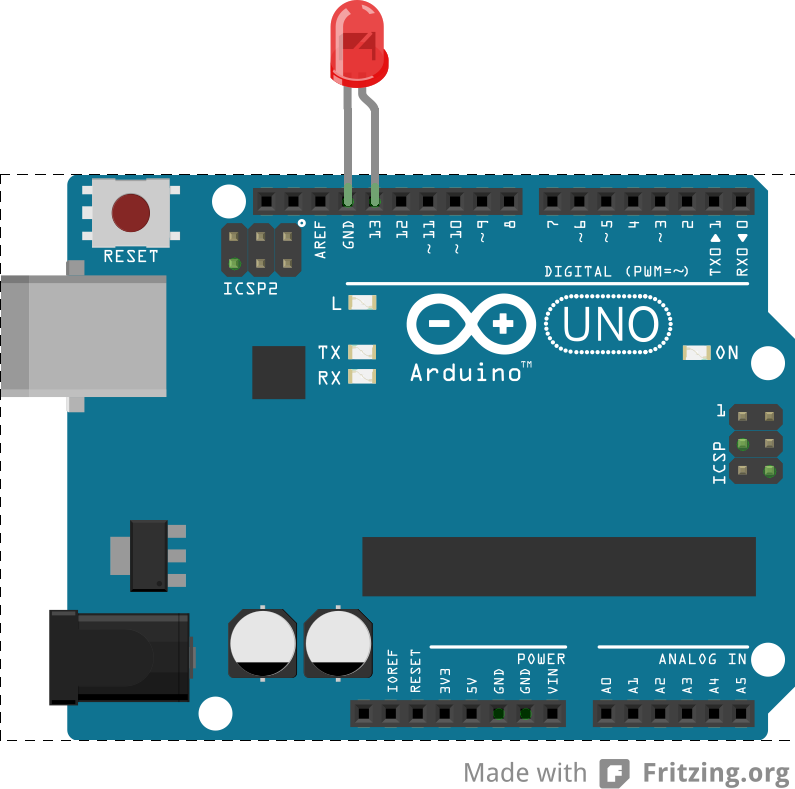
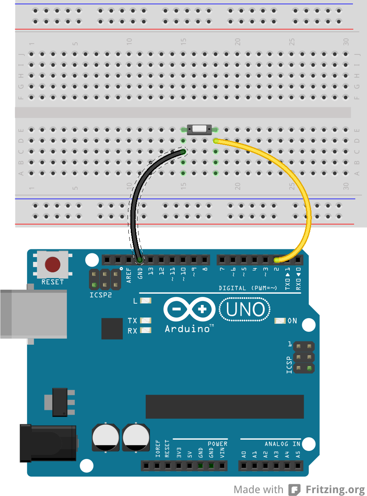
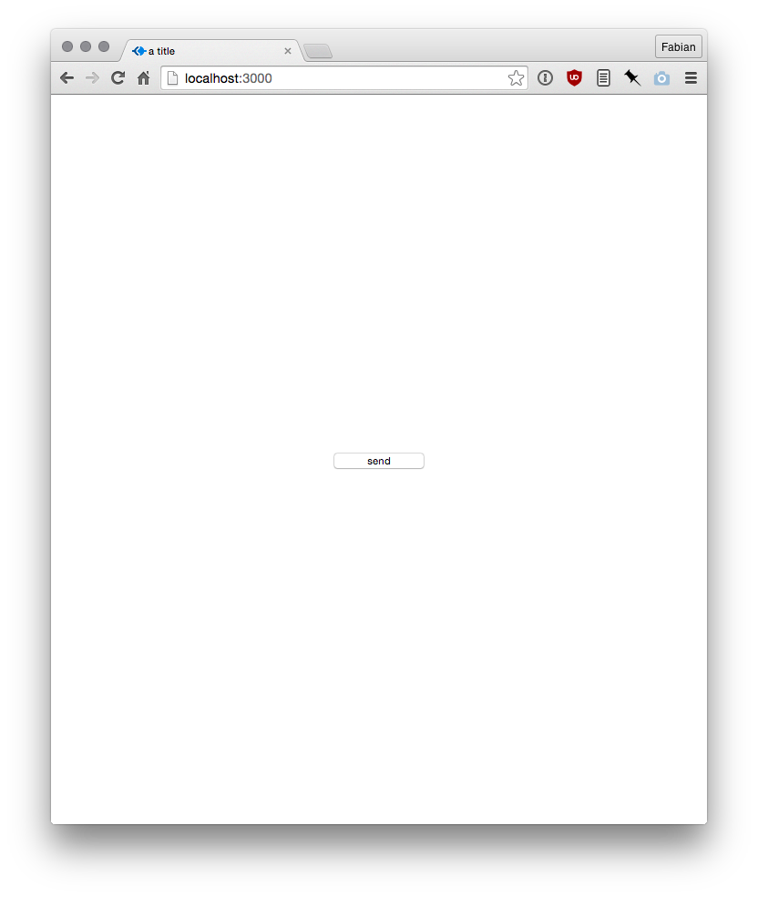
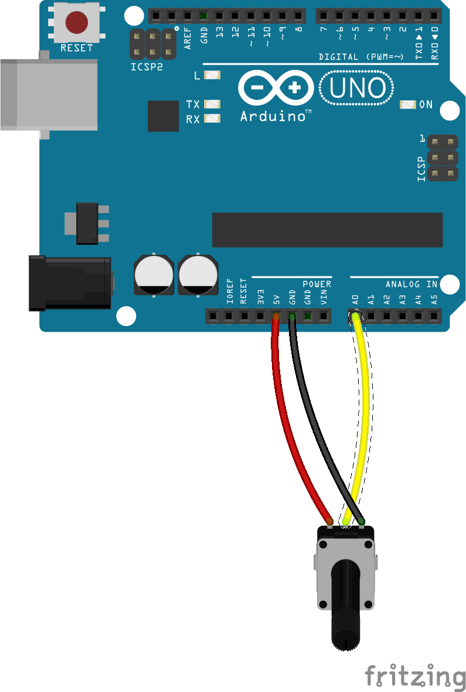
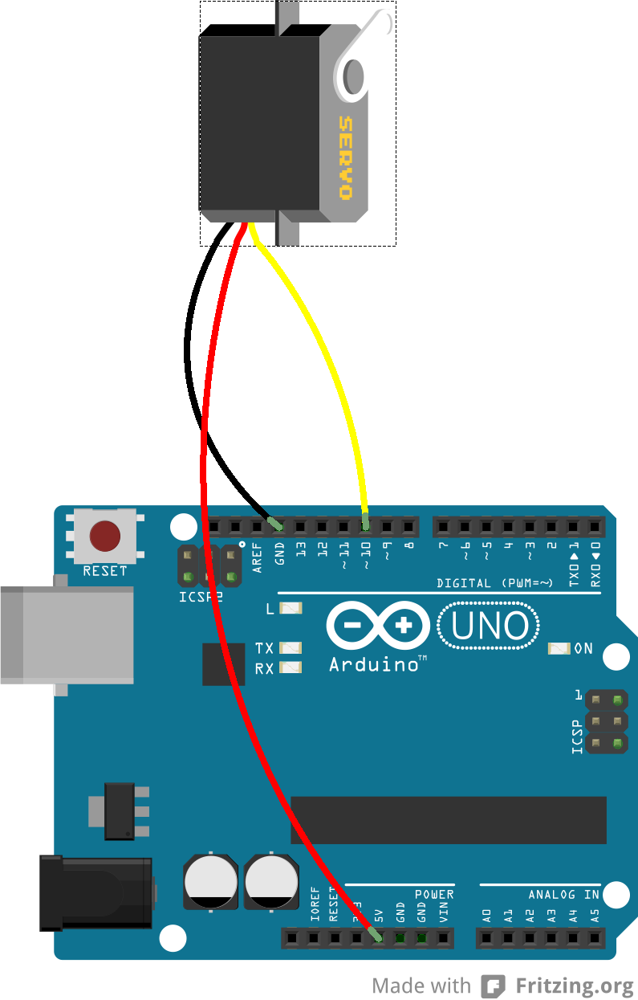
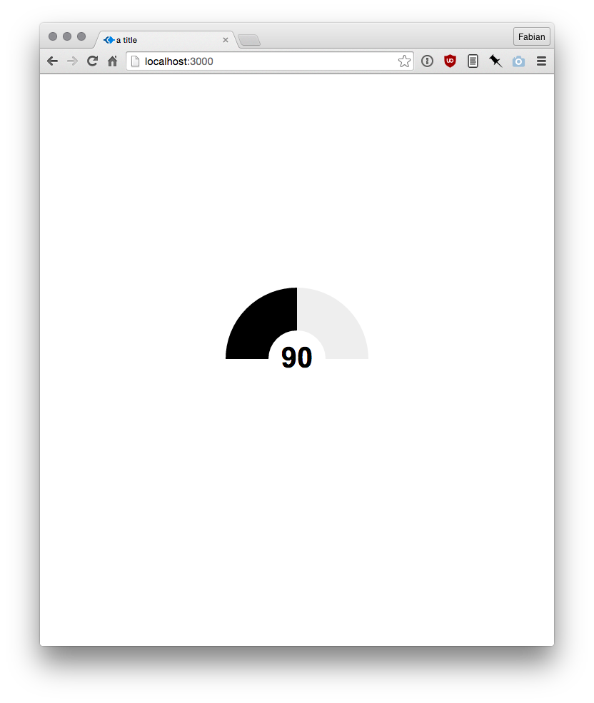

Johnny Five is alive  
====================

Examples for the workshop ["Johnny Five is Alive"](https://incom.org/workspace/6174) @ the University of Applied Sciences Potsdam (Germany).  

>Terms such as IOT, "Web of Things" or "Connected Devices" are used in an inflationary way in online and offline media. It is claimed that in 5 years 25 to 75 billion objects will be connected to the Internet. In order to develop prototypes for this field we require a toolkit that allows to mold hardware control and software from a single source.  
Appearance Johnny Five (The audience goes wild).

### Issues 

The latest Nodejs version (4.1.0) seem to have problems with the serialport module. We need to fallback to a working version (0.12.7 stable). Use [nvm](https://github.com/creationix/nvm) to install different versions.  

### Examples  

The project contains 4 examples.  

- [blink](blink/)  
- [button](button/)  
- [potentiometer](potentiometer/)  
- [servo](servo/)

See the fritzing sketches and the corresponding websites below.

#### Blink

  
  

#### Button  

  
  

#### Potentiometer  

  
  

#### Servo  

  
  

## License  

Copyright (c)  2015 Fabian "fabiantheblind" Morón Zirfas & FH-Potsdam (University of Applied Sciences Potsdam (Germany))
Permission is hereby granted, free of charge, to any person obtaining a copy of this software and associated documentation files (the "Software"), to deal in the Software  without restriction, including without limitation the rights to use, copy, modify, merge, publish, distribute, sublicense, and/or sell copies of the Software, and to  permit persons to whom the Software is furnished to do so, subject to the following conditions:  
The above copyright notice and this permission notice shall be included in all copies or substantial portions of the Software.  
THE SOFTWARE IS PROVIDED "AS IS", WITHOUT WARRANTY OF ANY KIND, EXPRESS OR IMPLIED, INCLUDING BUT NOT LIMITED TO THE WARRANTIES OF MERCHANTABILITY, FITNESS FOR A  PARTICULAR PURPOSE AND NONINFRINGEMENT. IN NO EVENT SHALL THE AUTHORS OR COPYRIGHT HOLDERS BE LIABLE FOR ANY CLAIM, DAMAGES OR OTHER LIABILITY, WHETHER IN AN ACTION OF  CONTRACT, TORT OR OTHERWISE, ARISING FROM, OUT OF OR IN CONNECTION WITH THE SOFTWARE OR THE USE OR OTHER DEALINGS IN THE SOFTWARE.  

see also http://www.opensource.org/licenses/mit-license.php

