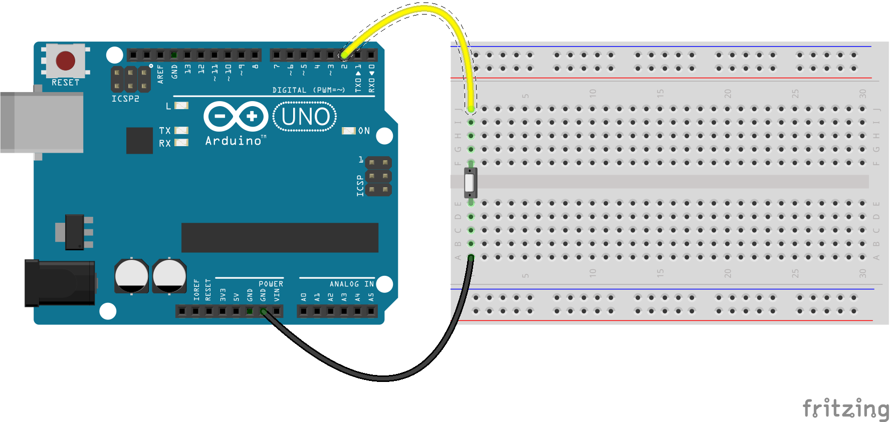

button
======

Simple example using a button attached as pull up and socket.io to communicate with the client side.  

  

usage:  

    npm install && npm start  

- Wait for the REPL to be initialized.
- Open [http://localhost:3000](http://localhost:3000)  
- press the button in the middle of the page and watch the console
- press the button on the breadboard and watch the browser window  

Known issues:  

- When the browser window already has the site [http://localhost:3000](http://localhost:3000) loaded the socket connection tries to establish before the board is initialized.  
